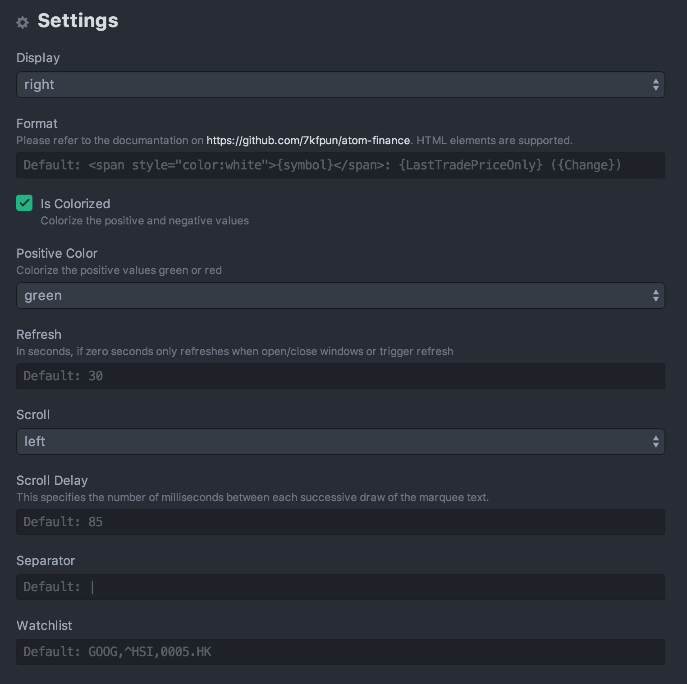

# Finance

Simple plugin for checking your stock in Atom.io editor (Yahoo Finance).


## Installing

1. Go to `Atom -> Preferences...`
2. Then select the `Packages` tab
3. Enter `finance` in the search box

#### Using apm

```sh
$ apm install finance
```

#### Install using Git

Alternatively, if you are a git user, you can install the package and keep up to date by cloning the repo directly into your `~/.atom/packages` directory.

```sh
$ git clone https://github.com/7kfpun/atom-finance.git ~/.atom/packages/finance
```

#### Download Manually

1. Download the files using the [GitHub .zip download](https://github.com/7kfpun/atom-finance/archive/master.zip) option and unzip them
2. Move the files inside the folder to `~/.atom/packages/finance`


## Usage

Display your stock watchlist in status bar.

#### Plugin settings page

To access the Finance Settings:

1. Go to `Atom -> Preferences...` or `cmd-,`
2. In the `Filter Packages` type `finance`



Finance has 5 settings that can be edited:

1. Display | default: `right`
2. Format | default: `{symbol}: {LastTradePriceOnly} ({Change})`
3. Refresh | default: `15` (In seconds, if zero seconds only refreshes when open/close windows or trigger refresh)
4. Scroll | default: `left`
5. Separator | default: ` | `
6. Watchlist | default: `GOOG,^HSI,0005.HK`

#### Commands

The following commands are available and are keyboard shortcuts.

* `finance:toggle` - Toggle - `ctrl-alt-f` `ctrl-alt-f`
* `finance:refresh` - Refresh - `ctrl-alt-r` `ctrl-alt-r`

#### QuoteProperty

    AfterHoursChangeRealtime
    AnnualizedGain
    Ask
    AskRealtime
    AverageDailyVolume
    Bid
    BidRealtime
    BookValue
    Change
    ChangeFromFiftydayMovingAverage
    ChangeFromTwoHundreddayMovingAverage
    ChangeFromYearHigh
    ChangeFromYearLow
    ChangePercentRealtime
    ChangeRealtime
    Change_PercentChange
    ChangeinPercent
    Commission
    Currency
    DaysHigh
    DaysLow
    DaysRange
    DaysRangeRealtime
    DaysValueChange
    DaysValueChangeRealtime
    DividendPayDate
    DividendShare
    DividendYield
    EBITDA
    EPSEstimateCurrentYear
    EPSEstimateNextQuarter
    EPSEstimateNextYear
    EarningsShare
    ErrorIndicationreturnedforsymbolchangedinvalid
    ExDividendDate
    FiftydayMovingAverage
    HighLimit
    HoldingsGain
    HoldingsGainPercent
    HoldingsGainPercentRealtime
    HoldingsGainRealtime
    HoldingsValue
    HoldingsValueRealtime
    LastTradeDate
    LastTradePriceOnly
    LastTradeRealtimeWithTime
    LastTradeTime
    LastTradeWithTime
    LowLimit
    MarketCapRealtime
    MarketCapitalization
    MoreInfo
    Name
    Notes
    OneyrTargetPrice
    Open
    OrderBookRealtime
    PEGRatio
    PERatio
    PERatioRealtime
    PercebtChangeFromYearHigh
    PercentChange
    PercentChangeFromFiftydayMovingAverage
    PercentChangeFromTwoHundreddayMovingAverage
    PercentChangeFromYearLow
    PreviousClose
    PriceBook
    PriceEPSEstimateCurrentYear
    PriceEPSEstimateNextYear
    PricePaid
    PriceSales
    SharesOwned
    ShortRatio
    StockExchange
    Symbol
    TickerTrend
    TradeDate
    TwoHundreddayMovingAverage
    Volume
    YearHigh
    YearLow
    YearRange
    symbol


## License

Released under the [MIT License](http://opensource.org/licenses/MIT).
